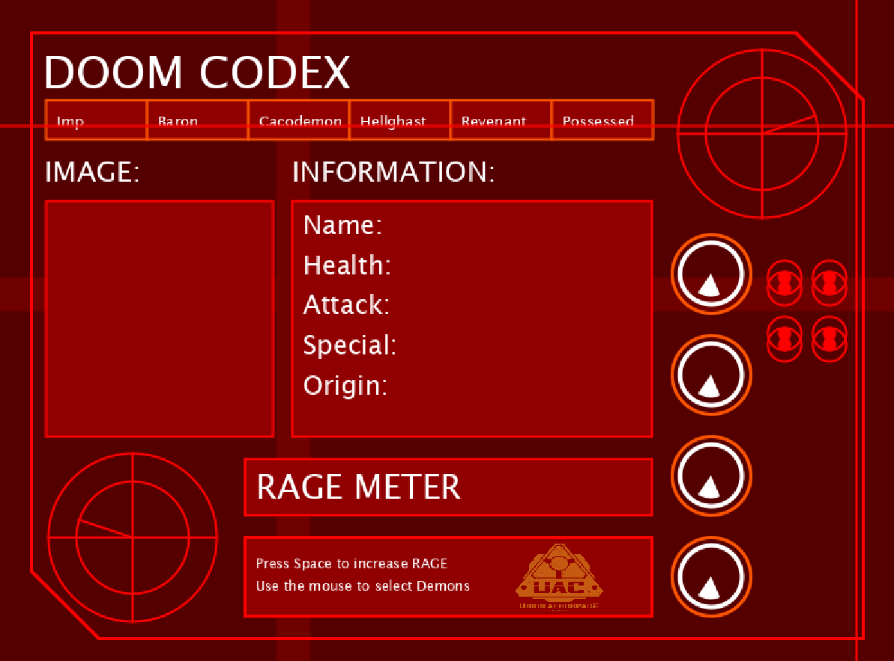
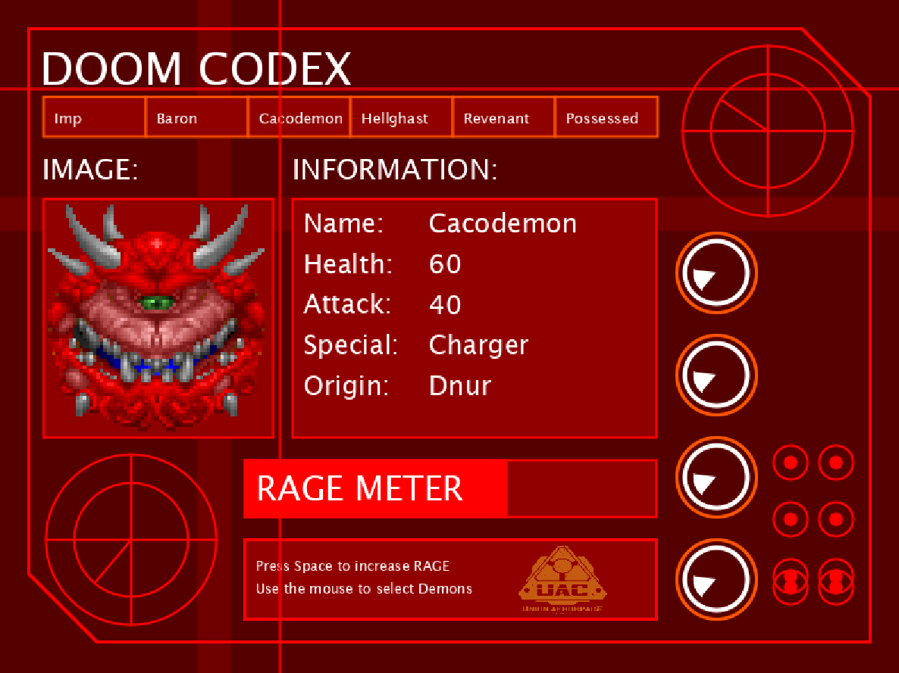

# SciFi UI Project

Name: Oscar Mangan

Student Number: C17486986

# Description of the assignment

The user interface I made is based and inspired on the original DOOM series video games from the early 1990s. The interface opens, and has several animated objects appearing on screen. The overall colour palette is red, as the same as the old games. The UI, along with the animations and drawings, will display a slideshow of the images of the enemies encountered in the DOOM games. 

A button menu at the top of the UI will allow users to select a demon, and display it's statistics; Name, Health Points, Attack Points, Special Attack name, and the origin of the demon. When the user selects a demon, it also displays an image, from the original game, of said demon in a image box to the left of the information box.

There is animation, in the 2 radars, 4 spinners, and the red circles which move up and down. There is also a rage meter, a small nod to the meme that the protagonist from DOOM, 'Doomguy' is "literally too angry to die". When the space button is pressed, the rage meter bar fills up. As well as this, the radars and spinners speed up, until SPACE is released.

# Instructions

Upon opening the UI, no demons image or information will be on display. Only upon using the mouse cursor, and clicking on the buttons, does the image and information of each demon display. If the user clicks on another demon button, the previous information and image is replaced by the current one.

If the user presses the SPACE bar, the rage meter at the bottom of the UI will fill up, causing the spinning animations to speed up and spin faster. Upon releasing the SPACE bar, the spinning animations will return back to normal speed.

There is a small text box at the bottom of the UI to give the user the control guide.

# How it works
Note! '...' is to cut down on repeating code, to make things easier to read in the report.

The main class is used to Run the UI class by calling and instantiating it. The UI class, also declares and instantiates the classes Radar, Spinner, Circle, Rage and uses the Demon class in an ArrayList. It also calls render() and update() within the draw() method, which loops while the UI is running, until it is closed. As seen here:

```Java
public void setup()
{
       // b = new Button(this, 50, 50, 100, 50, "I am a button");
        //mc = new MovingCircle(this, width / 2, height * .75f, 50);
        radar = new Radar(this, 1, 680, height / 5, 50);
        radar2 = new Radar(this, -1, 120, height - height / 5, 50);
        c1 = new Circle(this, 2, 740, 250, 30, 2);
        ....
        c8 = new Circle(this, 2, 700, 400, 30, 2);

        //Loading spinner animations
        sp1 = new Spinner(this, 635, 245, 1);
        ...
        sp4 = new Spinner(this, 635, 515, 1);

        //Loading images into program
        img1 = loadImage("imp.png");
        ....
        img6 = loadImage("possessed.png");
        uac = loadImage("uac.png");

        //Rage meter
        ragelevel = new Rage(this, 0, 220, 410, 0, 50);

        //Loading and printing data from codex.csv
        loadCSV();
        printCSV();
}
public void draw()
{
        //Animated radar
   	radar.update();
        radar.render();
        radar2.update();
        radar2.render();

        //Animated circles
        c1.render();
        c1.updateY();
        ...
        c8.render();
        c8.updateY();

        //Animated spinners
        sp1.render();
        sp1.update();
        ...
        sp4.render();
        sp4.update();
}
```
#### ArrayList
To implment the data from my 'codex.csv' file into the program. I used an ArrayList, as well as a seperate Demon class. The code below declares the ArrayList, as well as loading the data by iterating over each row in the table. I made a printCSV function to test and make sure the information was correctly printing to the Output. 

```Java
private ArrayList<Demon> demons = new ArrayList<Demon>();

public void loadCSV(){
        Table table = loadTable("codex.csv", "header");
        for (TableRow row : table.rows()) 
        {
            Demon demon = new Demon(row);
            demons.add(demon);
        }
    }
public void printCSV() {
        for (Demon demon : demons) {
            System.out.println(demon);
        }
    }
```

To display the demon information to visible text on the screen, I created the displayDemonInfo() method. I declared an empty String called fetchDemon also.

```Java
String fetchDemon = " ";

public void displayDemonInfo()
    {
        textSize(25);
        fill(255);
        text("INFORMATION:", 262, 150);
        fill(145, 0, 0);
        rect(262, 180, 320, 210);
        textSize(23);
        fill(255);
        text("\nName: \nHealth: \nAttack: \nSpecial: \nOrigin: ", 272, 252);
        text(fetchDemon, 382, 270);
    }

```
#### Getting the mouse click to work
To get this to work, I created a mouseClicked method, which uses the co-ordinates of the mouse cursor in the window to determine if the mouse is within the co-ordinates of the buttons. I used a variable called 'select', which is -1, unless the mouse button is clicked. When the button is clicked, the value for select is changed to whatever row of the table of demons the user has picked. 

This worked in getting the text information to display. To get the image of the selected demon to display, I had to create a PImage variable 'imgselect'. Then using if statements to compare through the list of images already loaded into the program, and setting the value of 'imgselect' accordingly. i.e. if Select is 2, then it will display the 3rd image out of the 6.

Code:
```Java
public void mouseClicked()
    {
        int select = -1;

        if(mouseY > buttonYBorder && mouseY < buttonYBorder + buttonHeight)
        {
            for(int i = 0; i < demons.size(); i++)
            {
                float xButton = buttonXBorder + (i * (buttonWidth));
                if(mouseX > xButton && mouseX < xButton + buttonWidth)
                {
                    select = i;
                    break;
                }
            } 
        }

        if (select != -1) //if one of the buttons were clicked
        {
            fetchDemon = demons.get(select).toString();
        }

        if (select == 0)
        {
            imgselect = img1;
        }
        if (select == 1)
        {
            imgselect = img2;
        }
        ...
        if (select == 5)
        {
            imgselect = img6;
        }
    }

```

#### RAGE meter bar
For this to work, I created a Rage class, which was declared and instantiated in UI, with a render() and update() method. For the SPACE bar to have an effect, I used the checkKeys method, then incrementing the length dimensions of the rectangle in the draw() method.
```Java
public void render()
    {
        ui.strokeWeight(2);
        ui.stroke(255,0,0);
        ui.fill(145,0,0);
        ui.rect(x,y,362,50);
        ui.fill(255,0,0);
        ui.rect(x,y,length,height);
        ui.fill(255);
        ui.textSize(30);
        ui.text("RAGE METER", x + 10, y + 21);
    }

    public void update()
    {
        if(ui.checkKey(' '))
        {
            length++;
            if(length > 362)
            {
                length = 362;
            }
        }
        else
        {
            length--;
            if(length < 0)
            {
                length = 0;
            }
        }
    }
```

When the space bar was pressed, as the rage bar fills up, I used similar code in the Radar and Spinner classes to make the rotation speed up.

```Java
public void update()
    {
        HALF_PI += 0.1;
        rad += 0.1;
        if(ui.checkKey(' '))
        {
            HALF_PI += 0.2;
            rad += 0.2;
        }
    }
    
public void update()
    {
        theta += PApplet.TWO_PI * timeDelta * frequency;
        if(ui.checkKey(' '))
        {
            theta += 0.5f;
        }
    }    
```

# What I am most proud of in the assignment
I am happy with the overall theme and idea I had. I'm too young to remember the original DOOM games, however I'm a big fan of the reboot in 2016. It was fun to try and come up with something, but also having free reign to come up with any kind of SciFi design. The interface is quite simplistic, with some interactivity and animation. I would have liked to cleaned things up in terms of less pixelation, tried different colours, etc. I've grasped an understanding of classes, objects, inheritance, ArrayLists, etc. With more time, especially with summer coming, I would like to either improve this project, or create another one anew and make more improvements.

I am happy that once I completed the work, I felt I learned a lot about Object Oriented Programming. I feel if I spent more time on this project, I could make it more complicated, including more procedural graphics and more animation. I was happy that I could find some kind of interactivity to include, but I feel I could come up with some more ideas in time.




This is a youtube video:
(https://www.youtube.com/watch?v=72IH-n90Vc0&)

